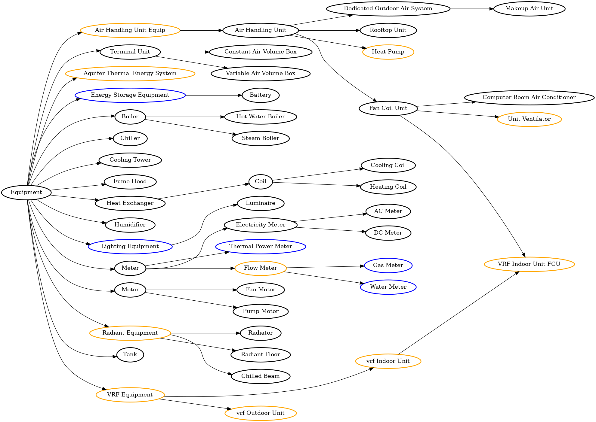

# Brick/Haystack Harmonization

## Get Started

1. [Install Poetry for Python dep management](https://python-poetry.org/docs/master/#installing-with-the-official-installer)
2. Install dependencies by running `poetry install` or `make install-deps` in this repo
3. Visualize the current taxonomy file with `make visualize-taxonomy`; the graph will be in `unified_taxonomy.png`
4. Check congruency issues between the unified taxonomy and the different ontologies:
    - `make check-taxonomy` will run these for you
    
## Unified Taxonomy

## Ontology Reports

[Brick Report](brick_report.txt)
